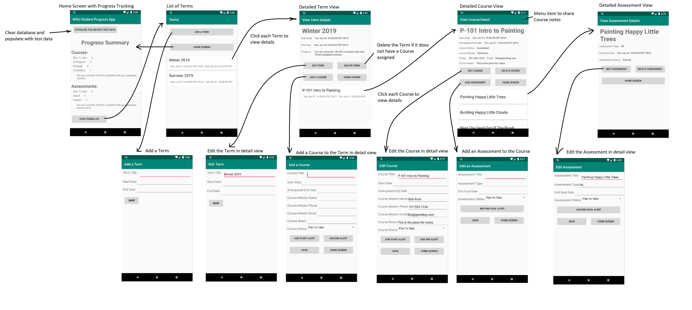

# JeffQuarnbergWGUTrackingApp
### An Android Mobile App in Java developed using Android Studio for one of my university courses.

This app is designed to provide a way for a student to track and display their progress through the terms, courses, and assessments of their degree program.
# Overview
The app provides:
* The ability to enter, edit, and delete term, course, and assessment data to a local SQLite database
* A summary of the student's progress through their courses and assessments
* The ability to set alerts to notify the student of approaching start or end dates for courses and assessments
* A sharing feature for optional course notes

* A list of terms with details including:
  * Term title
  * Start date
  * End date
  * List of courses associated with each selected term
    
* A list of courses in each term with details including:
  * Course title
  * Start date
  * Anticipated end date
  * Status (In Progress, Completed, Dropped, Plan To Take)
  * Instructor's name, phone number, and email address
  * Add custom notes for each course
  * List of assessments associated with each selected course
  
* A list of assessments in each course with details including:
  * Assessment title
  * Assessment type
  * End goal date
  * Assessment status

# Storyboard

